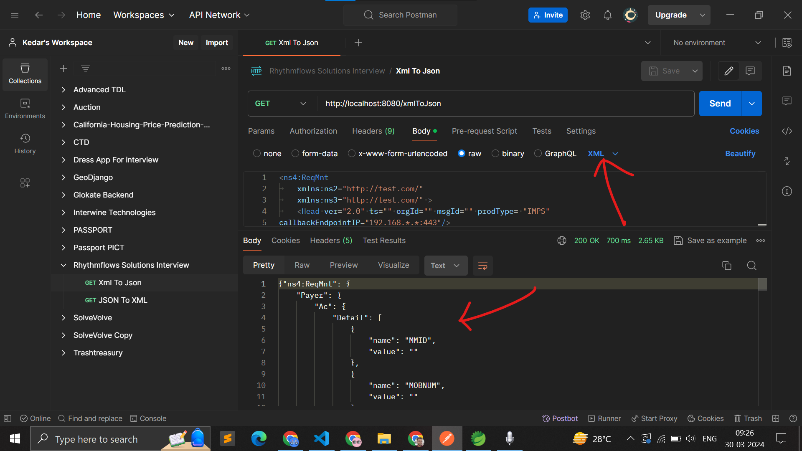
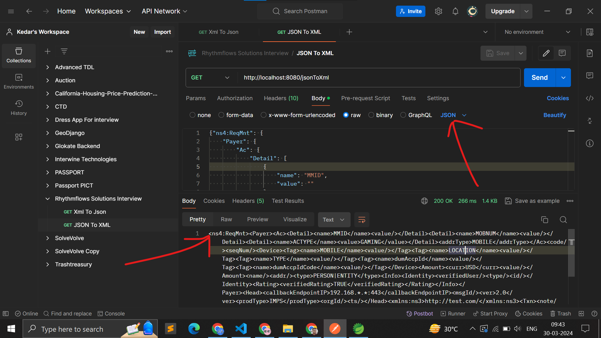

# Routes -

```
/xmlToJson -> converts json to xml from input given in the body(Body should be in XML format in postman)

```



```
/jsonToXml -> converts json to xml from input given in the body(Body should be in either text or JSON format in postman)
```



# Note -

You can also use the postman collection given above for getting the urls and their input types.

# Note

I MISTAKENLY added postgrsql driver, remove it via removing it from pom.xml, otherwise it give any database name in XML-JSON_Converter\src\main\resources\application.properties
along with postgresql username & password
